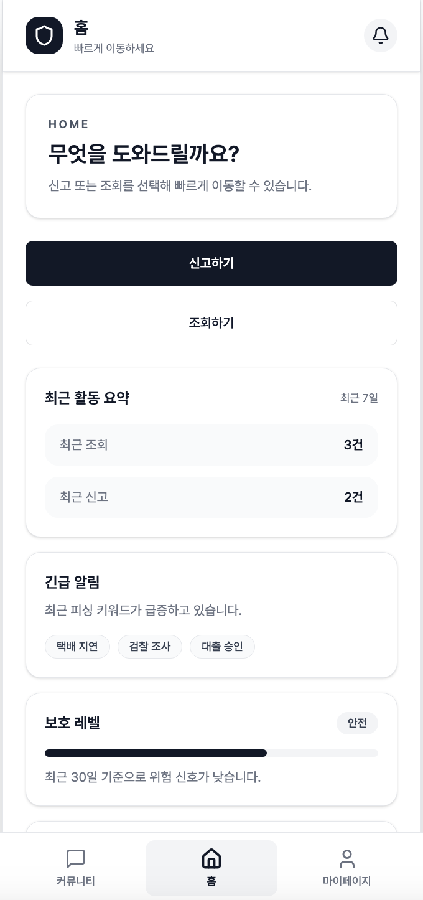

# Smishing Prevention (Monorepo)

안드로이드 앱(Kotlin + Firebase)과 웹(React + Spring Boot + Firebase)을 함께 관리하는 모노레포입니다.
## 📱 Main Page
<p align="center">
  
</p>

## 프로젝트 구조
- `android-app/`: Android 앱 (Kotlin + Firebase)
- `web-frontend/`: 웹 프론트엔드 (Vite + React + Firebase)
- `web-backend/`: 웹 백엔드 (Spring Boot Java 21 + Firebase Admin)
- `docs/`: 문서

## 공통 사전 준비
- Node.js 18+ (프론트)
- JDK 21 (백엔드)
- Android Studio 최신 버전 (안드로이드)
- Firebase 프로젝트 생성

## Firebase 설정
### 1) 웹 프론트엔드
`web-frontend/.env.example`을 복사해 `web-frontend/.env.local`을 만들고 값을 채워주세요.

필수 키:
- `VITE_FIREBASE_API_KEY`
- `VITE_FIREBASE_AUTH_DOMAIN`
- `VITE_FIREBASE_PROJECT_ID`
- `VITE_FIREBASE_STORAGE_BUCKET`
- `VITE_FIREBASE_MESSAGING_SENDER_ID`
- `VITE_FIREBASE_APP_ID`

### 2) 웹 백엔드
Firebase Admin SDK는 Application Default Credentials(ADC)를 사용합니다.

예시:
```
export GOOGLE_APPLICATION_CREDENTIALS="/path/to/service-account.json"
```

### 3) 안드로이드
Firebase 콘솔에서 Android 앱을 등록 후 `google-services.json`을 내려받아
`android-app/app/google-services.json`에 추가하세요.

## 실행 방법
### 웹 프론트엔드
```
cd web-frontend
npm install
npm run dev
```

### 웹 백엔드
```
cd web-backend
./gradlew bootRun
```

### 안드로이드
- Android Studio에서 `android-app/` 열기
- Gradle Sync 후 실행

## 주요 의존성
- Android: Firebase Auth / Firestore / Storage
- Frontend: Firebase JS SDK (Auth / Firestore / Storage)
- Backend: Firebase Admin SDK

## 문서
- `docs/README.md` 참고
